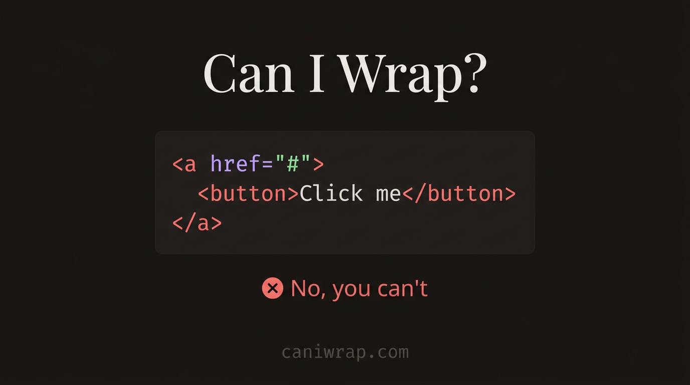

<div align="center">



# Can I Wrap?

**Check if you can nest one HTML element inside another according to the HTML specification.**

[caniwrap.com](https://caniwrap.com)

</div>

## About

Can I Wrap? is a free, instant lookup tool for HTML element nesting rules. Type a child and a parent element, and it tells you whether the nesting is valid, invalid, or context-dependent — with explanations, code examples, and links to MDN.

Data is sourced from the [HTML Living Standard](https://html.spec.whatwg.org/multipage/) and [MDN Web Docs](https://developer.mozilla.org/en-US/docs/Web/HTML).

## Features

- **Nesting validation** — Checks if an element can be placed inside another based on content model rules.
- **Detailed explanations** — Shows why a combination is valid, invalid, or depends on context.
- **Code examples** — Provides highlighted HTML snippets for each check.
- **Content categories** — Browse all HTML elements organized by their content categories (flow, phrasing, interactive, embedded, heading, sectioning).
- **Popular checks** — Quick access to common nesting questions like `<div>` inside `<span>` or `<a>` inside `<button>`.
- **Autocomplete** — Search elements by tag name or description.
- **Shareable URLs** — Results are reflected in the URL so you can share a specific check.
- **MDN references** — Direct links to MDN documentation for both elements.

## Tech Stack

- [Astro](https://astro.build/) 6
- [Tailwind CSS](https://tailwindcss.com/) 4
- TypeScript

## Getting Started

### Prerequisites

- Node.js >= 22.12.0
- [pnpm](https://pnpm.io/)

### Installation

```bash
pnpm install
```

### Development

```bash
pnpm dev
```

Opens the dev server at `http://localhost:4321`.

### Build

```bash
pnpm build
```

### Preview

```bash
pnpm preview
```

## Project Structure

```
├── public/
│   ├── favicon.svg
│   ├── og-image.png
│   └── robots.txt
├── src/
│   ├── components/
│   │   └── PixelHeart.astro
│   ├── data/
│   │   └── html-nesting.ts      # Element definitions and nesting logic
│   ├── layouts/
│   │   └── Layout.astro
│   ├── lib/
│   │   └── sponsors.ts          # GitHub Sponsors integration
│   ├── pages/
│   │   └── index.astro
│   ├── scripts/
│   │   └── checker.ts           # Client-side nesting checker
│   └── styles/
│       └── global.css
├── astro.config.mjs
└── package.json
```

## Inspiration

This project is inspired by [Can I Include?](https://caninclude.glitch.me/) by [AJ](https://twitter.com/AJ_), a tool that checks whether a given HTML element can be contained within another. Can I Wrap? builds on the same idea with updated data from the current HTML Living Standard, a redesigned interface, and extended nesting logic including content categories and contextual rules.

## License

MIT

## Author

Built by [midudev](https://midu.dev).
